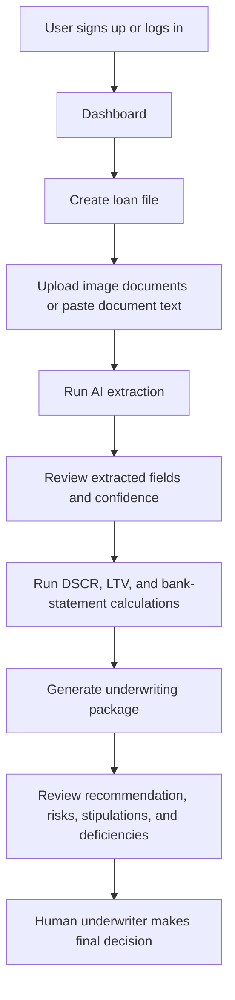
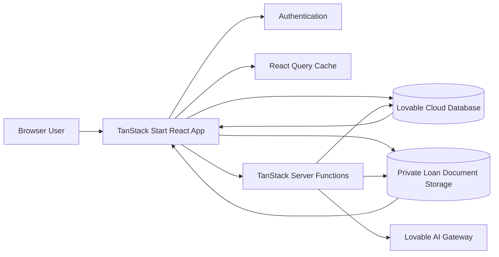
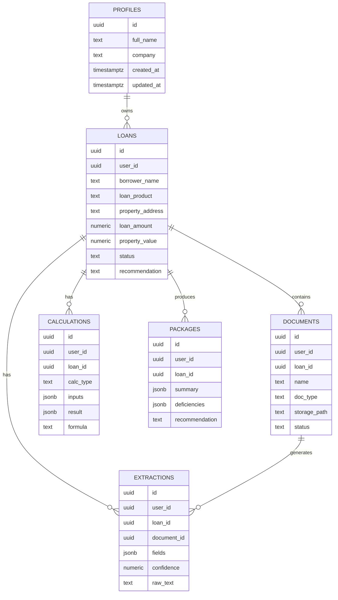
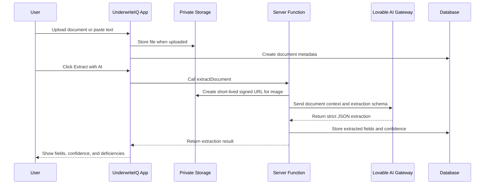

# UnderwriteIQ

**AI document intelligence for Non-QM mortgage underwriting.**

UnderwriteIQ is an MVP SaaS platform for lenders, brokers, private-credit teams, and mortgage operations groups that need to process complex Non-QM loan files faster without losing underwriting discipline. It turns scattered loan documents into structured borrower/property data, deterministic eligibility calculations, and a decision-ready underwriting package.

---

## Executive Summary

Mortgage teams spend too much time manually reading documents, copying numbers into spreadsheets, chasing missing conditions, and rewriting credit narratives. Non-QM files are especially painful because borrowers often qualify through DSCR, bank statements, asset depletion, foreign-national guidelines, or entity ownership structures instead of clean agency documentation.

UnderwriteIQ solves this by combining:

- **AI extraction** from uploaded images or pasted document text.
- **Deterministic mortgage calculators** for DSCR, LTV, and bank-statement income.
- **A secured loan workspace** for each underwriter.
- **Decision package generation** with strengths, risks, deficiencies, stipulations, and recommendation.
- **A real database, authentication, private storage, and row-level data isolation** for real users.

The product is designed to reduce a first-pass Non-QM review from hours to minutes, improve consistency across underwriters, and help teams scale volume without scaling headcount linearly.

---

## What Problem Does It Solve?

### The underwriting bottleneck

Non-QM underwriting is document-heavy, inconsistent, and expensive. Teams must review rent rolls, appraisals, leases, bank statements, borrower IDs, income documents, entity documents, tax records, insurance, title, and property data. Every file requires judgment, but much of the first-pass work is repetitive:

1. Read each document.
2. Extract key fields.
3. Check missing items.
4. Calculate DSCR, LTV, qualifying income, and risk metrics.
5. Summarize findings for credit, capital markets, or loan officers.
6. Repeat whenever a new document arrives.

### The cost of the old workflow

- **Time loss:** Underwriters spend hours per file on manual review and spreadsheet work.
- **Money loss:** High-cost underwriting staff are used for low-leverage extraction and formatting tasks.
- **Revenue leakage:** Slow turn times reduce pull-through and borrower/broker confidence.
- **Operational risk:** Manual copy/paste workflows create inconsistent conditions and missed deficiencies.
- **Scaling limits:** More loan volume typically requires more processors and underwriters.

---

## How UnderwriteIQ Solves the Problem

UnderwriteIQ gives every loan a structured workspace:

1. **Create a loan file** with borrower, product, property, value, and requested amount.
2. **Upload or paste documents** such as leases, appraisals, bank statement summaries, IDs, or tax docs.
3. **Run AI extraction** to convert unstructured content into normalized fields with confidence scores.
4. **Run deterministic calculations** for DSCR, LTV, and bank-statement income.
5. **Generate a decision package** that summarizes the file for credit review.

The core principle is simple: **AI reads and drafts; deterministic code calculates; humans decide.**

---

## Does It Save Time?

Yes. UnderwriteIQ is designed to compress the repetitive first-pass review cycle.

| Workflow Step | Traditional Process | UnderwriteIQ MVP |
| --- | --- | --- |
| Document intake | Manual upload + naming | Centralized loan workspace |
| Field extraction | Manual reading and copy/paste | AI extraction to structured fields |
| DSCR/LTV calculations | Spreadsheet or LOS worksheet | Built-in deterministic calculators |
| Deficiency review | Manual checklist | AI-generated missing-item list |
| Credit narrative | Written from scratch | AI-generated decision package draft |
| File handoff | Email/thread/slack summary | Package stored against loan file |

Expected MVP impact for a first-pass file review:

- **60-80% less manual extraction time** for supported documents.
- **Faster condition identification** because deficiencies are surfaced immediately.
- **Faster credit narrative drafting** because package generation produces a structured first draft.
- **Less context switching** because documents, calculations, and summaries live together.

---

## Does It Save Money?

Yes. Savings come from operating leverage, reduced rework, and faster cycle times.

### Direct cost savings

- Senior underwriters spend less time on clerical data extraction.
- Processors can prepare files faster before escalation.
- Teams can handle more loans without proportional headcount increases.

### Revenue impact

- Faster turn times improve broker experience.
- Earlier deficiency detection reduces dead-cycle time.
- Faster conditional approvals can improve pull-through.

### Risk reduction

- Standardized calculations reduce spreadsheet drift.
- Structured decision packages improve consistency.
- Data isolation and private document storage support real-user security expectations.

---

## MVP Feature Set

### Implemented

- Public marketing homepage.
- Email/password signup and login.
- Authenticated application shell.
- User-scoped loan pipeline dashboard.
- Loan creation workflow.
- Sample loan onboarding path.
- Loan list and loan detail workspace.
- Private document storage bucket.
- Document upload metadata tracking.
- AI extraction from images and pasted text.
- Example document text for demo onboarding.
- Extraction review with confidence score and structured field cards.
- DSCR calculator.
- LTV calculator.
- Bank statement income calculator.
- Calculation history.
- AI-generated underwriting package.
- Recommendation persisted back to the loan.
- Profile/settings page.
- Compliance/security positioning page.
- Row-level user isolation for core tables.
- README-level system design and architecture documentation.

### Pending After MVP

- Native PDF text extraction instead of requiring pasted PDF/OCR text.
- Organization/team workspaces and role-based permissions.
- Detailed audit log UI.
- LOS/POS integrations.
- Export package to PDF.
- Custom investor guideline matrices.
- Human review/approval state machine.
- Document checklist templates by loan product.
- Multi-borrower and guarantor modeling.
- Automated fraud/risk cross-checks.
- Production billing/subscription plans.

---

## User Workflow



---

## System Architecture



### Architectural choices

- **TanStack Start** powers the React application, routing, server rendering, and backend server functions.
- **Lovable Cloud database** stores user-scoped loan data, documents metadata, extractions, calculations, profiles, and packages.
- **Private object storage** holds uploaded loan documents.
- **Row-level security** isolates each user's loan records.
- **Lovable AI Gateway** powers extraction and underwriting package generation without exposing model credentials in the browser.
- **Deterministic TypeScript calculators** ensure DSCR, LTV, and bank-statement income are reproducible.

---

## Data Model



---

## AI Processing Flow



---

## Calculation Engine

The MVP uses deterministic formulas implemented in TypeScript.

### DSCR

```text
DSCR = Gross Monthly Rent / (PITI + HOA)
```

Tiering:

- `strong`: DSCR >= 1.25
- `qualifying`: DSCR >= 1.10
- `weak`: DSCR >= 1.00
- `fail`: DSCR < 1.00

### LTV

```text
LTV = Loan Amount / Property Value * 100
```

### Bank Statement Income

```text
Business income = Average Monthly Deposits * (1 - Expense Factor)
Personal income = Average Monthly Deposits
```

---

## Security Model

UnderwriteIQ is built for real-user isolation from day one.

- Users authenticate before accessing the workspace.
- Loan, document, extraction, calculation, package, and profile records are scoped by `user_id`.
- Database policies restrict users to their own records.
- Loan documents are stored in a private bucket.
- AI calls run through server functions, not directly from browser code.
- Secrets are server-side only.
- Uploaded document access uses short-lived signed URLs only when needed for processing.

---

## Compliance Positioning

UnderwriteIQ is a decision-support platform, not an autonomous credit decision maker. The product is designed so human underwriters remain responsible for final decisions.

Important operating principles:

- AI-generated outputs should be reviewed by qualified staff.
- Deterministic calculations should be traceable and reproducible.
- Deficiencies and stipulations should be verified against investor guidelines.
- Final credit decisions must follow applicable fair lending, privacy, and investor requirements.

---

## Example Demo Scenario

Use the dashboard's **Load sample loan** action to create a DSCR example:

- Borrower: Avery Chen
- Product: DSCR
- Property: 1180 Harbor View Dr, Tampa, FL
- Loan amount: $640,000
- Property value: $875,000

Inside the loan workspace, use the built-in sample document buttons:

- Example lease agreement
- Example property appraisal
- Example business bank statement summary

Then run extraction, save calculations, and generate a decision package.

---

## Product Roadmap

### Phase 1: MVP

- Core authenticated workspace.
- Loan pipeline.
- AI extraction.
- Deterministic calculations.
- Decision package generation.

### Phase 2: Team Operations

- Organizations and team roles.
- Assignment queues.
- Review states.
- Audit history.
- Package export.

### Phase 3: Investor Intelligence

- Guideline matrix engine.
- Investor-specific overlays.
- Scenario comparison.
- Automated exception detection.

### Phase 4: Enterprise Integrations

- LOS/POS integrations.
- Webhooks.
- Document provider integrations.
- SSO/SAML.
- Usage analytics and billing.

---

## Technical Stack

- **Frontend:** React 19, TanStack Router, TanStack Query, Tailwind CSS v4, shadcn-style UI primitives.
- **Full-stack runtime:** TanStack Start server functions.
- **Backend:** Lovable Cloud database, authentication, and private storage.
- **AI:** Lovable AI Gateway using Gemini-class models.
- **Validation:** Zod for server-function input validation.
- **State:** React Query for data fetching and cache invalidation.
- **Styling:** Semantic design tokens in `src/styles.css`.

---

## Running Locally

```bash
bun install
bun run dev
```

The app expects Lovable Cloud environment variables to be available through the managed project environment.

---

## Login Note

If login shows **"Failed to fetch"** in Lovable Preview, this is a known preview-environment auth fetch proxy issue affecting authentication POST requests. The auth implementation is configured correctly; test authentication on the published app URL for the reliable production behavior.

---

## Current Status

UnderwriteIQ is now a usable MVP for real-user evaluation. It has the core workflow required to create loans, structure documents, calculate underwriting metrics, and generate a first-pass decision package. The next build phase should focus on production-grade team collaboration, PDF-native extraction, package exports, investor guideline rules, and payments.
